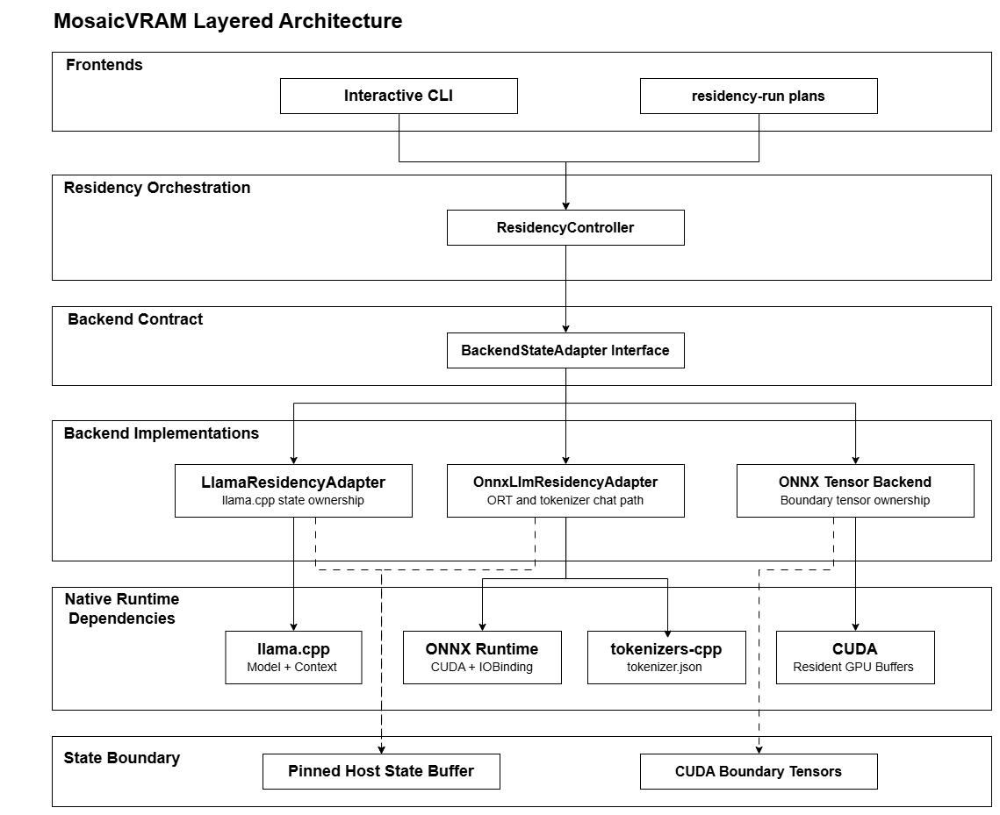
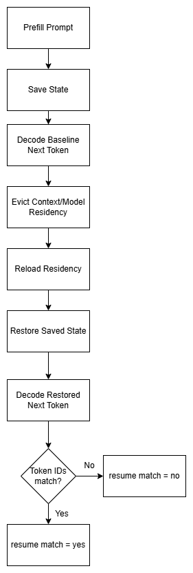

# Developer Guide

This guide covers the build, architecture, and validation workflow for changing
MosaicVRAM.

## Build

Run builds from a Visual Studio x64 developer shell.

Base build:

```text
cmake -S . -B build -G Ninja
cmake --build build
```

Build with ONNX Runtime:

```text
cmake -S . -B build-onnx -G Ninja ^
  -DMOSAICVRAM_ENABLE_ONNX=ON ^
  -DMOSAICVRAM_ONNXRUNTIME_DIR=deps\onnxruntime-win-x64-gpu-1.25.1
cmake --build build-onnx
```

Build with llama.cpp:

```text
cmake -S . -B build-llama -G Ninja ^
  -DMOSAICVRAM_ENABLE_LLAMA=ON ^
  -DMOSAICVRAM_LLAMA_DIR=..\llama.cpp ^
  -DMOSAICVRAM_LLAMA_BUILD_DIR=..\llama.cpp\build-cuda
cmake --build build-llama
```

Build with both LLM adapters and tokenizer JSON support:

```text
git clone https://github.com/mlc-ai/tokenizers-cpp.git deps\tokenizers-cpp
git -C deps\tokenizers-cpp submodule update --init --recursive
```

```text
cmake -S . -B build-llama-onnx -G Ninja ^
  -DMOSAICVRAM_ENABLE_LLAMA=ON ^
  -DMOSAICVRAM_LLAMA_DIR=..\llama.cpp ^
  -DMOSAICVRAM_LLAMA_BUILD_DIR=..\llama.cpp\build-cuda ^
  -DMOSAICVRAM_ENABLE_ONNX=ON ^
  -DMOSAICVRAM_ONNXRUNTIME_DIR=deps\onnxruntime-win-x64-gpu-1.25.1 ^
  -DMOSAICVRAM_ENABLE_TOKENIZER_JSON=ON ^
  -DMOSAICVRAM_TOKENIZERS_CPP_DIR=deps\tokenizers-cpp
cmake --build build-llama-onnx
```

Rust/Cargo is needed while building `tokenizers-cpp`, but it is not a runtime
requirement. ONNX Runtime GPU requires ONNX Runtime, CUDA, and cuDNN DLLs on
`PATH`.

## Architecture

At a high level, MosaicVRAM separates lifecycle orchestration from each
backend's native state format:



Solid arrows show normal control or runtime dependency paths. The frontends call
into `ResidencyController`, which drives backend implementations through the
shared `BackendStateAdapter` interface. Backend adapters then call their native
runtime dependencies, such as llama.cpp, ONNX Runtime, tokenizers-cpp, and CUDA.

Dashed arrows show save/restore state-boundary paths. They are separate from the
normal inference call path: llama.cpp and ONNX LLM sessions save backend state
into pinned host memory, while the tensor backend tracks CUDA-side boundary
tensors.

The residency controller drives one lifecycle across backend adapters:

```text
SaveState()
EvictContext()
EvictModel()
ReloadModel()
RestoreState()
ResumeCheck()
```

State is copied to pinned host memory while GPU residency is evicted:

- llama.cpp: full or sequence state through llama.cpp state APIs.
- ONNX LLM: KV cache tensors copied between CUDA memory and pinned host memory.
- ONNX tensor backend: lifecycle and boundary tensor ownership only, not a full
  language-model state adapter.

## ONNX LLM Adapter

The ONNX LLM adapter uses lower-level ONNX Runtime `Ort::Session` and
`IoBinding`, not the high-level generator API. That keeps the KV-cache tensors
visible so MosaicVRAM can save and restore them directly.

Supported decoder surfaces include:

```text
input_ids
inputs_embeds
attention_mask
position_ids
num_logits_to_keep
past_key_values.*.key
past_key_values.*.value
present.*.key
present.*.value
past_conv.* / present_conv.*
past_recurrent.* / present_recurrent.*
logits
```

If the decoder uses `inputs_embeds`, the adapter looks for a sibling ONNX model
that converts token IDs into embeddings and runs that model before the decoder.

The adapter intentionally fails closed when required graph inputs, dtypes, or
provider-specific operators are unsupported. That is safer than pretending a
stateful restore is valid.

## Tokenizer And Chat Templates

When `MOSAICVRAM_ENABLE_TOKENIZER_JSON=ON`, ONNX chat loads Hugging Face
`tokenizer.json` through `tokenizers-cpp`.

`tokenizer_config.json` is used for:

- chat template marker detection
- special added token IDs
- stop-string handling
- stripping special control tokens from displayed text

The native adapter does not evaluate arbitrary Jinja. It supports common marker
families used by tested model exports. This is template-shape handling, not
model-name hardcoding.

## Deterministic Resume

A deterministic resume test proves that a restored session continues from the
same state as the saved session. The test is token-based, not text-based.



The controlled flow is:

```text
prefill prompt
save backend state
decode one next token as the baseline
evict context/model residency
reload residency
restore saved state
decode one next token from restored state
compare restored token against baseline token
```

A session passes when:

```text
baseline_next_token == restored_next_token
resume_match=yes
status=ok
```

For multi-token checks, compare the full generated token ID sequence. Similar
text is not enough; token IDs must match.

Important output fields:

```text
sessionN_prompt_tokens
sessionN_prefill_ms
sessionN_save_state_ms
sessionN_evict_context_ms
sessionN_evict_model_ms
sessionN_model_reload_ms
sessionN_session_reload_ms
sessionN_restore_state_ms
sessionN_resume_check_ms
sessionN_baseline_next_token
sessionN_restored_next_token
sessionN_resume_match
```

For ONNX LLMs, also inspect:

```text
sessionN_logits_dtype
sessionN_logits_vocab_size
sessionN_logits_finite_count
sessionN_logits_nan_count
sessionN_decode_valid
sessionN_position_ids_present
sessionN_prefill_chunks
sessionN_prefill_chunk_tokens
sessionN_kv_state_bytes
sessionN_restored_kv_state_bytes
```

`kv_state_bytes` and `restored_kv_state_bytes` should be nonzero and match for
ONNX LLM sessions. llama.cpp sessions should report nonzero state bytes.

## residency-run

`residency-run` executes reproducible lifecycle plans:

```text
mosaicvram.exe residency-run --plan path\to\plan.txt
```

Example:

```text
session id=1 backend=llama model="models\qwen.gguf" prompt="My name is xjghft. Remember this." ctx=512 batch=512 gpu_layers=-1 device=0
session id=2 backend=onnx-llm model="models\qwen3.onnx" tokenizer="models\qwen3" prompt="My name is xjghft. Remember this." prefill_chunk=512 device=0

step op=load session=1
step op=prefill session=1
step op=save session=1
step op=baseline session=1
step op=evict_context session=1
step op=evict_model session=1

step op=load session=2
step op=prefill session=2
step op=save session=2
step op=baseline session=2
step op=evict_context session=2
step op=evict_model session=2

step op=reload_model session=1
step op=restore session=1
step op=resume_check session=1
```

Supported step operations:

```text
load
prefill
save
baseline
evict_context
evict_model
reload_model
restore
resume_check
restore_then_generate
switch_gpu_owner
```

`restore_then_generate` can run a short continuation after restore. For ONNX,
the session must have `tokenizer=` when text input is used:

```text
step op=restore_then_generate session=2 text=" What is my name?" max_tokens=32
```

`expect` and `expect_tokens` are optional demo checks. `resume_match=yes` is the
stricter deterministic-resume signal.

## GPU Smoke Tests

Long-context smoke tests are documented in
[GPU_SMOKE_TESTS.md](GPU_SMOKE_TESTS.md). They generate plans under
`tests/generated/` and validate llama.cpp-only, ONNX-only, and mixed-backend
handoff flows.

Typical commands:

```powershell
cmd /c tests\run_gpu_smoke.bat llama
cmd /c tests\run_gpu_smoke.bat onnx
cmd /c tests\run_gpu_smoke.bat mixed
```

## ONNX Tensor Backend

The `run` command supports simple ONNX Runtime tensor workloads:

```text
mosaicvram.exe run --backend onnx --model models\vgg16-7.onnx --iters 100 --io cpu --provider cuda --input ramp
mosaicvram.exe run --backend onnx --model models\vgg16-7.onnx --iters 100 --io cuda --provider cuda --input ramp
```

`--io cpu` reports `LifecycleOnly`. `--io cuda` reports `BoundaryTensor`,
meaning MosaicVRAM owns CUDA input/output buffers bound into the ONNX session.

Dynamic tensor shapes can be provided with:

```text
--shape input_name=1x3x224x224
```

## Formatting

All C++ files should pass `clang-format`:

```powershell
& "C:\Program Files\Microsoft Visual Studio\2022\Professional\VC\Tools\Llvm\x64\bin\clang-format.exe" --dry-run --Werror <files>
```

Code style follows the Google C++ Style Guide naming conventions.
